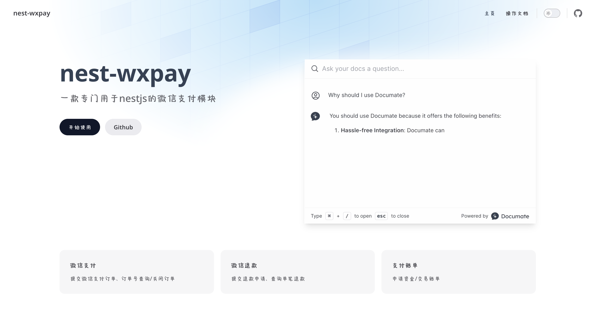

# nest-wxpay



通过nestjs封装的微信支付模块，点击前往 [查看文档](https://cxladder.cn)

## 安装
```bash
npm i --save nest-wxpay
yarn add nest-wxpay
```

## 注册模块

```ts
import { Module } from '@nestjs/common'
import { WechatModule } from 'nest-wxpay'

@Module({
  imports: [
    WechatModule.register({
      appid: '公众号的appid',
      mchid: '微信支付商户号',
      serial_no: '商户证书序列号',
      privateKey: '商户私钥'
    })
  ]
})
export class AppModule {}
```
